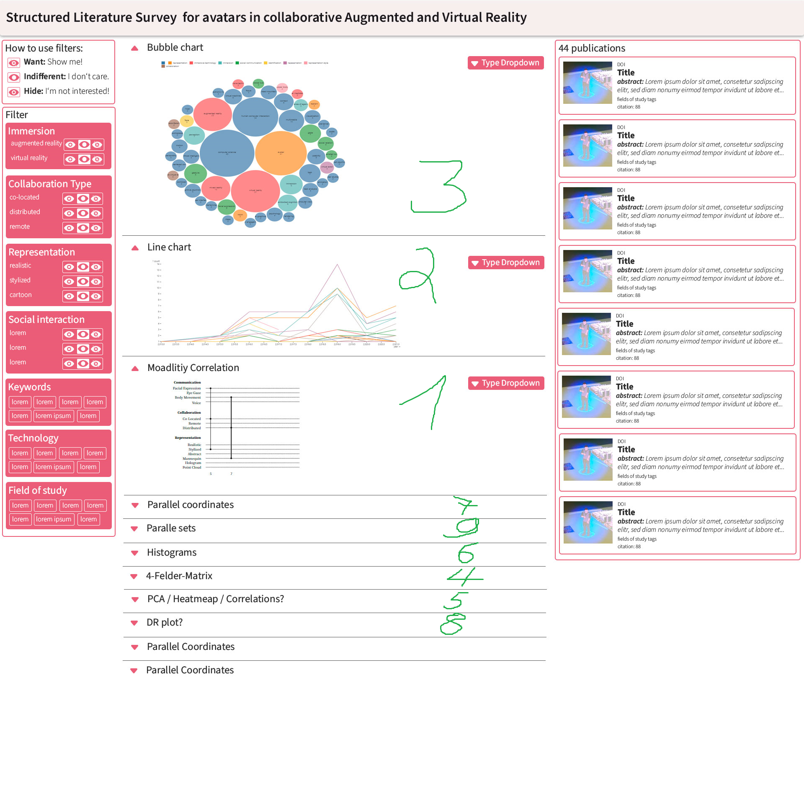

# TODO

1. [TODO](#todo)
2. [Tasks](#tasks)
   1. [GitHub](#github)
   2. [Observable](#observable)
   3. [Sketch](#sketch)
   4. [Notes for visualizations](#notes-for-visualizations)

# Tasks

- filter
  - FH really not sure whether visibility toggles are a good idea, confusing and annoying to implement
    - just do like item selections?

- vis
  - modality
    - choose pairs
    - sort by jaccard?

## GitHub

https://github.com/visvar/vr-ar-avatar-survey

## Observable

https://observablehq.com/d/87c5f6eaa8e83adc

## Sketch

## Notes for visualizations

- Bubble chart
  - **What to show:** distribution of words/authors/etc. for bubble size, color grouping for fieldOfStudy
- Line Chart *Done*
  - for each year:
    - keywords
    - fieldOfStudy
  - **What to show:** change of topics over the years
- Modality correlation
  - collaboration vs. immersion vs. representation vs. social interaction
  - **What to show:** correlation of modalities according to line width between two (or more???) modalities
    - Communication: Facial expression, eye gaze, body movement, voice, point cloud
    - Collaboration: co-located, remote, distributed,
    - Immersion: AR, VR
    - Representation: realistic, stylized, cartoon, mannequin, hologram
- Bar chart
  - fieldOfStudy -> coloring like bubble chart
  - authors
  - conferences
  - **What to show:** Basic distribution of occurrences, not for everyone, only more than 2-3 times
- Force directed graph
  - publications as data points and fieldOfStudy for force, coloring based on conference
  - **What to show:** which publications correlate with other publications, based on the fieldOfStudys, how strong are the links?
- Scatterplot
  - dynamic selection of x/y axis, choose two of:
     - collaboration
     - social interaction
     - representation
     - immersion type
     - **What to show:** occurrences based on features, potentially highlight clusters in the data
